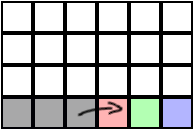

# WaveFunctionCollapse with quantum wave function collapse (QWFC)

QWFC is an experimental implementation of the [WFC](https://github.com/mxgmn/WaveFunctionCollapse) algorithm for quantum
computers. The original program generates images that appear similar to an input image by randomly drawing image
elements in an iterative fashion. A detailed explanation of the algorithm can for example be
found [here](https://robertheaton.com/2018/12/17/wavefunction-collapse-algorithm).

WFC is a quantum-inspired but in fact completely classical algorithm: "Unobserved" parts of an image are in a "
superposition" of various possibilities depending on the already "collapsed" (i.e., selected) parts. QWFC is an attempt
to implement the quantum concept from which WFC is inspired on an actual gate-based quantum computer by creating a
quantum circuit that prepares a suitable superposition state using [Qiskit](https://qiskit.org/). To this end, the
tilemap approach of WFC is considered, in which each image—or map—is composed of a set of tiles and certain rules
restrict the placement of these tiles depending on adjacent tiles. Each tile is encoded in or or more qubits such that
the prepared state is a superposition of all possible tile layouts. A measurement consequently reveals a random
realization. QWFC is not a one-to-one recreation of WFC, but a simplified version that has the goal to achieve a similar
end result.

This is just a little hobby project and not actively maintained.

## Algorithm

**Input:**

1. Definition of the tileset: Alphabet of tiles.
    * Each tile is encoded by a consecutive integer.
    * `N` qubits are required to encode one tile with an alphabet of size `2^N`.
2. Definition of the map: Ordered set of tiles with adjacency relations.
    * In total, `N*k` qubits are required to encode an alphabet of size `2^N` and `k` tiles on the map.
3. Definition of the generator: Tile placement probabilities based on adjacency relations.

**Circuit generation:**

1. Start with the first tile in the list.
2. Prepare the qubits in a superposition state based on already traversed tiles and the specified placement
   probabilities.
3. Repeat from 2. with the next tile in the list until all qubits have been prepared.

## Example

As a trivial example, consider a one-dimensional map with only white/black tiles that is traversed from left to right
with the following checkerboard rules:

1. If the tile on the left is black, only allow a white tile (with 100% probability).
2. If the tile on the left is white, only allow a black tile (with 100% probability).
3. If there is no tile on the left, choose either a black or white tile (each with 50% probability).
   This map can be encoded with one qubit per tile: state `0` corresponds to white and state `1` corresponds to black.

For the first tile, rule 3 applies. It is therefore prepared in a superposition state with a simple Hadamard gate. For
the second tile, rules 1 and 2 apply. These rules can be implemented with a controlled rotation. Similarly for
subsequent tiles.

A one-dimensional map with three tiles (reed, green and blue) obviously looks like this:

The resulting circuit to produce checkerboard tiles is then:

Since every tile can only be in two states, three qubits are sufficient to represent the entire map. The colors indicate
which qubits corresponds to which tile. Measuring this circuit reveals two tile layouts (starting with a white tile or
starting with a black tile) with the same probability:

That is, the circuit produces a state that represents *all* valid layout combinations in a superposition (two in this
simple case). Its measurement *collapses* the state onto one definite layout. That's the simple idea behind QWFC.

## Real quantum device

The QWFC code can be used for quantum simulations as well as for experiments on real quantum hardware via
[IBMQ](https://www.ibm.com/quantum).
Let's consider a simple example again, a two-dimensional 2 by 3 checkerboard map (as described above) that is realized
with 6 qubits.
A circuit of this size can for example be executed on the freely accessible hardware device *ibm_lagos* (Falcon r5.11H
QPU)
with 7 qubits in total.
Due to hardware imperfections, more than the theoretically allowed two superpositions (starting with either a black or a
white tile) are typically measured in such an experiment.
Here is a plot of an exemplary result:

Each bar in the plot represents a different state with a height according to its measured probability (sorted in
descending order). The little image on top shows the encoded map. Only the two green bars are theoretically allowed, all
red bars are theoretically forbidden.
In the top right corner, the connectivity map of *ibm_lagos* is shown.

## Hybrid algorithm

Since current quantum hardware is very limited (and computationally expensive to simulate), a hybrid quantum-classical
algorithm is also implemented in which the map is traversed with a sliding window. For each iteration, a circuit is
generated and measured for the sliding window region, also taking the adjacency relations outside of the window into
account. With this approach, significantly bigger maps can be generated.

For example, to extend the one-dimensional checkerboard map from above, a sliding window made out of three tiles can be
slided from left to right and bottom to top to create a bigger, two-dimensional checkerboard map.

## Quantum poetry

WFC has enabled
a [wide range of variations](https://github.com/mxgmn/WaveFunctionCollapse#notable-ports-forks-and-spinoffs) that can
also be considered for QWFC. For example, to generate _quantum poetry_ in the spirit of the classical poetry
generator [oisin](https://github.com/mewo2/oisin). A simple quantum poetry generator is implemented in this repository.

It can generate poems like this:

_said the dormouse! said the gryphon and the hatter instead! the queen said the mock turtle. but it was the king however
it is the duchess and then the gryphon replied very soon as it was that you?_

In addition, the generation process can be visualized in form of images that can be combined to an animation:

